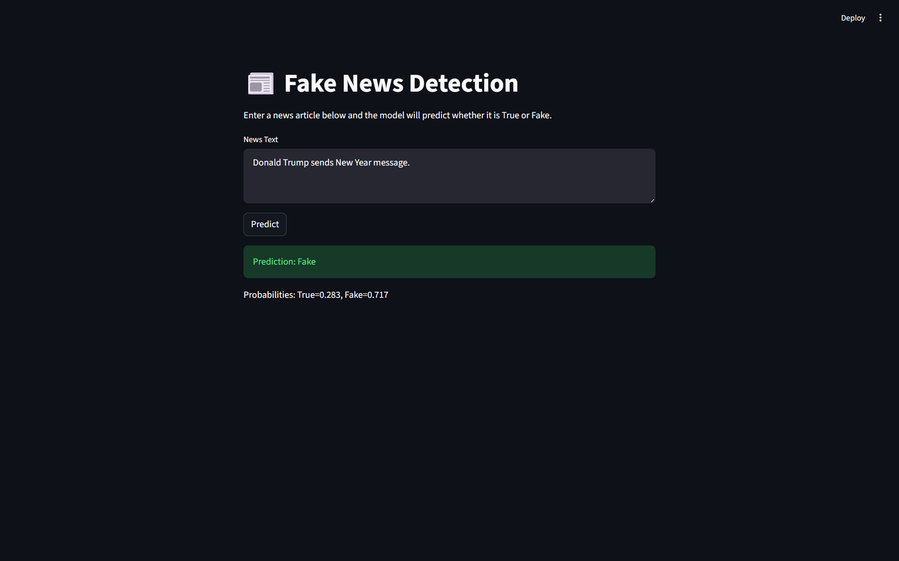

# 📰 Fake News Detection

**Fake News Detection** is a machine learning project designed to **automatically identify and flag fake news articles**. Using NLP techniques and machine learning classifiers like **Logistic Regression** and **Naive Bayes**, it also includes an interactive **Streamlit UI** for live predictions.

---

## 🌟 Overview

The goal of this project is to analyze news articles and classify them as:

* **Real News 🟢**
* **Fake News 🔴

This helps users, researchers, and organizations to identify misinformation quickly and reliably.

---

## 🎯 Features

* Cleans and preprocesses text: lowercasing, removing URLs/special characters, stopwords removal, lemmatization.
* Converts text to numeric features using **TF-IDF vectorization**.
* Trains **Logistic Regression** and **Multinomial Naive Bayes** models.
* Evaluates models with accuracy, confusion matrix, and classification report.
* Interactive **Streamlit app** for live predictions.

---

## 🛠 Technologies Used

* Python 3
* pandas, numpy
* scikit-learn
* NLTK / spaCy for text preprocessing
* Streamlit for UI
* Joblib for saving/loading models

---

## 🚀 Live Demo

Try the app online here:

[](https://fakenewsdetection-sivxtqszxykdtyywrntsjb.streamlit.app/)

---


## 💻 How to Run Locally

### Step 1: Clone the repository

```bash
git clone https://github.com/Myself-Praveen/Fake_news_detection.git
cd Fake_news_detection
```

### Step 2: Install required packages

```bash
pip install -r requirements.txt
```

### Step 3: Run the main notebook or Streamlit app

#### Option 1: Using Jupyter Notebook

```bash
jupyter notebook
```

Open the notebook and run all cells to preprocess, train, and evaluate models.

#### Option 2: Using Streamlit UI

```bash
streamlit run src/app.py
```

Enter a news article in the textbox and click **Predict** to see whether it is True or Fake.

---

## 🖼 Screenshot

Here is an example of the project in action:


*Streamlit interface for live predictions.*

> You can add more screenshots inside the `assets` folder if desired.

---

## 🤝 How to Contribute

1. Fork the repository
2. Clone your fork locally
3. Create a new branch for your changes
4. Add features, improve models, or clean data
5. Commit changes with a descriptive message
6. Push to your fork
7. Open a Pull Request

---

## 📝 Support

If you encounter issues or have questions, feel free to **open an issue** on GitHub.

---

## 🎨 Author

**Praveen Mishra**
GitHub: [Myself-Praveen](https://github.com/Myself-Praveen)
